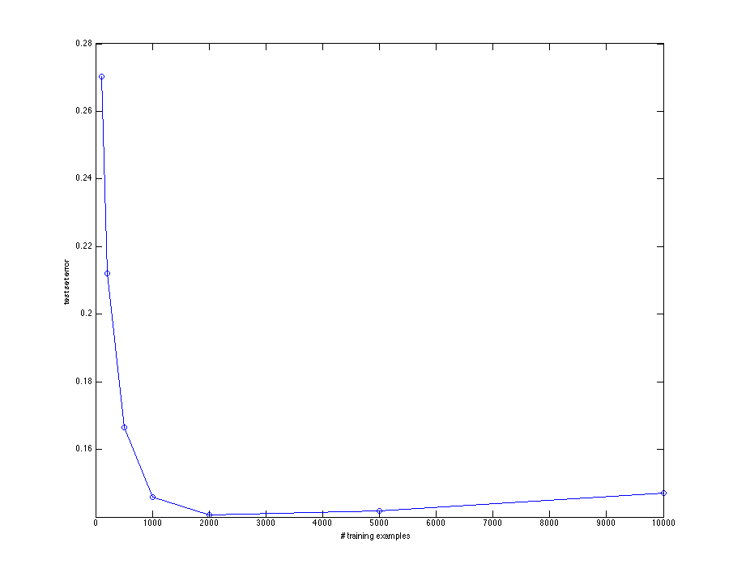
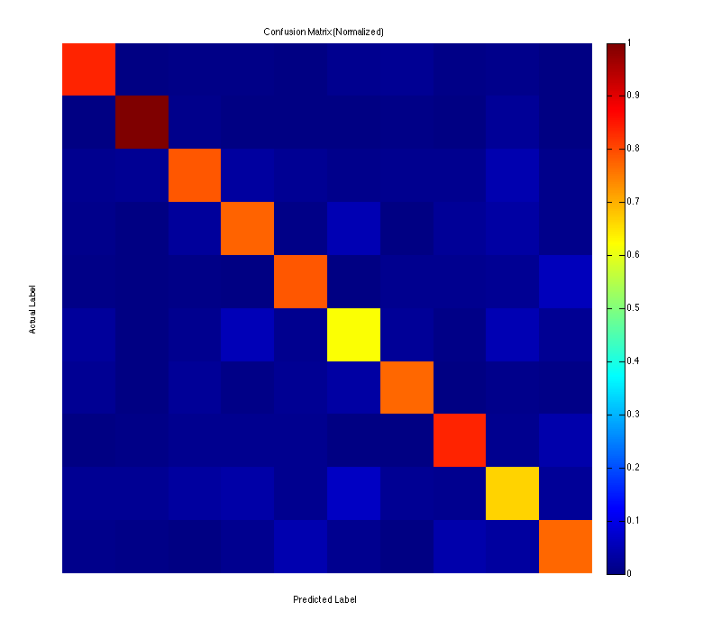

Homework 1
==========
##### Amy Tsai
Question 1
----------

__Parameters__: (Default)
 
- type: L2-regularized L2-loss support vector classification
- cost: 1
- epsilon: 0.1
- bias: -1

__Discussion__: The test set error bottoms out when training with the 2000 training set at around 14%, then increases with more training examples. This is most likely because of overfitting.

Question 2
----------

__Code__: trains and predicts on the 10,000 training set. Plots predicted labels vs. true lables in a confusion matrix. Confusion matrix values are normalized between 0 and 1 to apply color map.

__Insights__: The strong red/orange diagonal on the confusion matrix indicates that the predictions cluster around the correct answer. You can see which digits tend to be most accurate (0, 1, 7) from their red coloring and which digits tend to have the most errors (5, 8) from the yellow coloring.

Question 3
----------
Cross validation helps us "test" our hyper-parameters and avoid overfitting. It is like having a trial run which allows  us to estimate an error rate without having to use the real test data. The concept is the same as using a held-out set to test the trained model. Using k folds avoids the case where the held-out set happens to be an outlier set.

The optimal value of 'C' found using cross-validation was .00000027. The cross validation error with this parameter was around 10%. The test set error trained on the 10,000 data set was around 9.4%. Trained on the full data set, the test set error around 8.5%