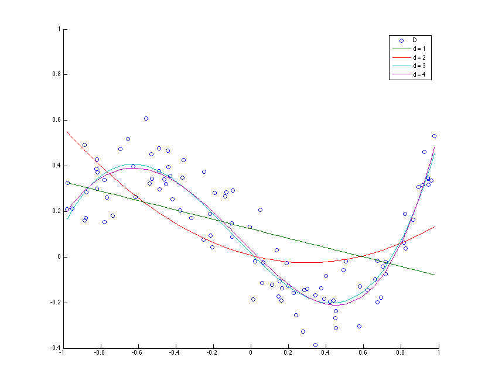
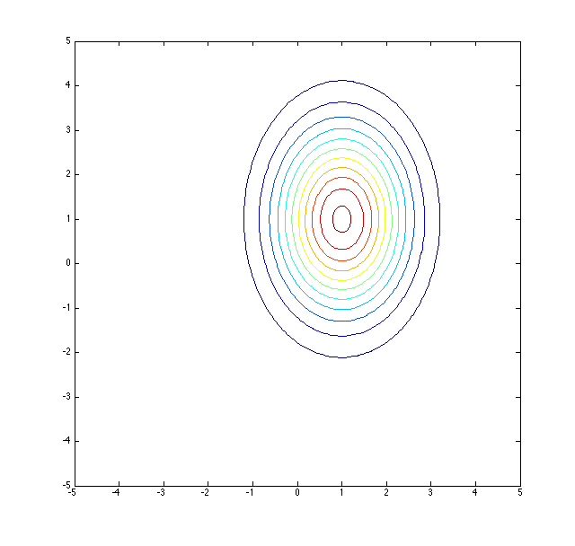
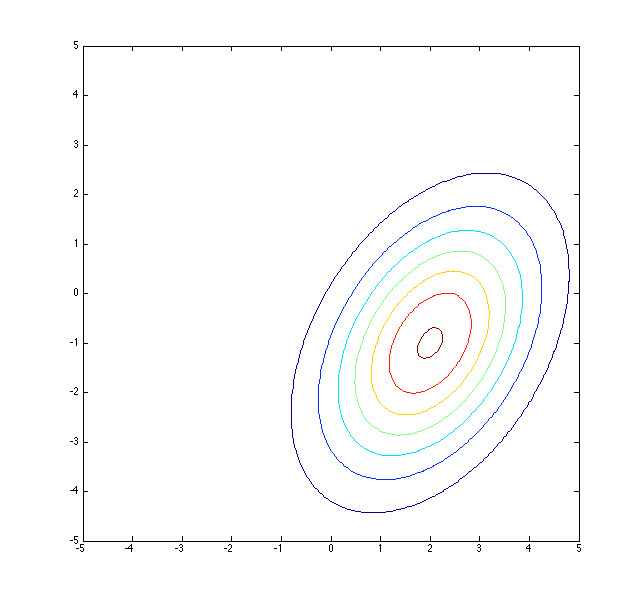
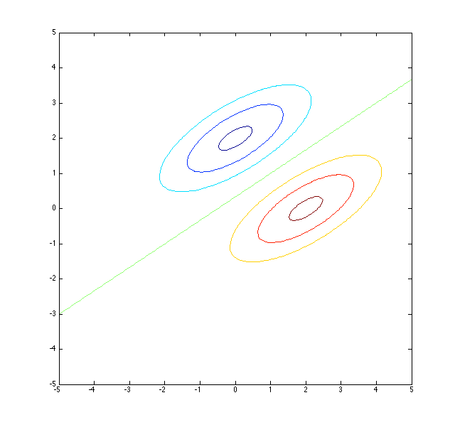
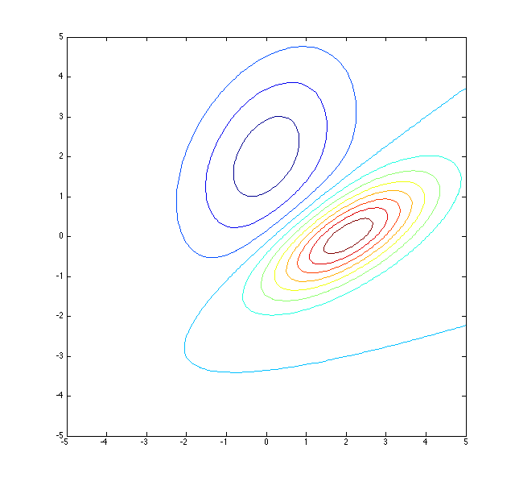
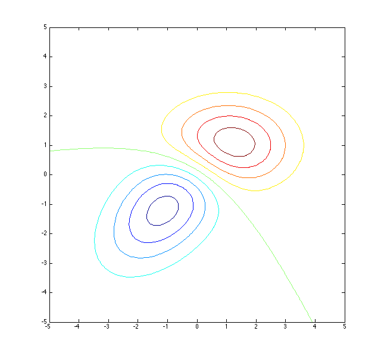
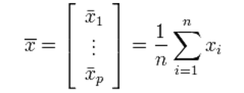
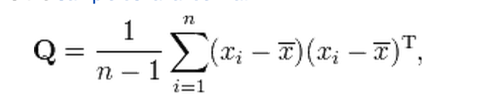
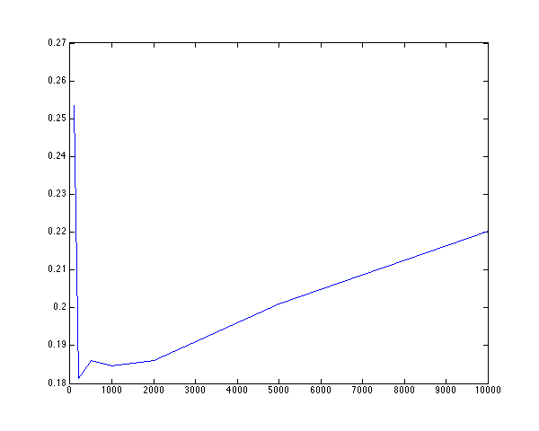
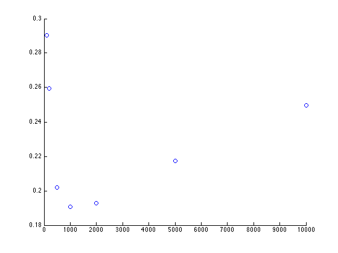

HW3
===

Question 1
----------
### (A)
Errors =  
[4.5427,
3.4368,
0.9714,
0.9537,
0.9393,
0.9348,
0.9347,
0.9331,
0.9301,
0.9092]

d = 10 has the smallest error rate. However, in practice using d = 10 will probably over fit. d = 3 is most likely the best choice.

### (B)
Test error (d=3) = 5.1577

Test error (d=10) = 5.7307

A degree 10 polynomial is overfitted to the training data and a degree 3 polynomial generalizes better to the test data.

Question 2
----------
### (i)

### (ii)

### (iii)

### (iv)

### (v)

Question 3
----------
### (i)
The MLE estimates of the mean and covariance matrices for a multivariate gaussian are as follows

These are unbiased estimators

###(ii)
I modeled the prior distribution of the classes by using their rate of occurrence in the training set.

###(iii)
This is the covariate matrix of class "1" displayed as a heat map.

The image shows that the matrix is symmetric and semidefinite.

###(iv)
#### A

This is a linear decision boundary since we are essentially calculating a linear combination in 784 space.

#### B

This is a quadratic decision boundary.
